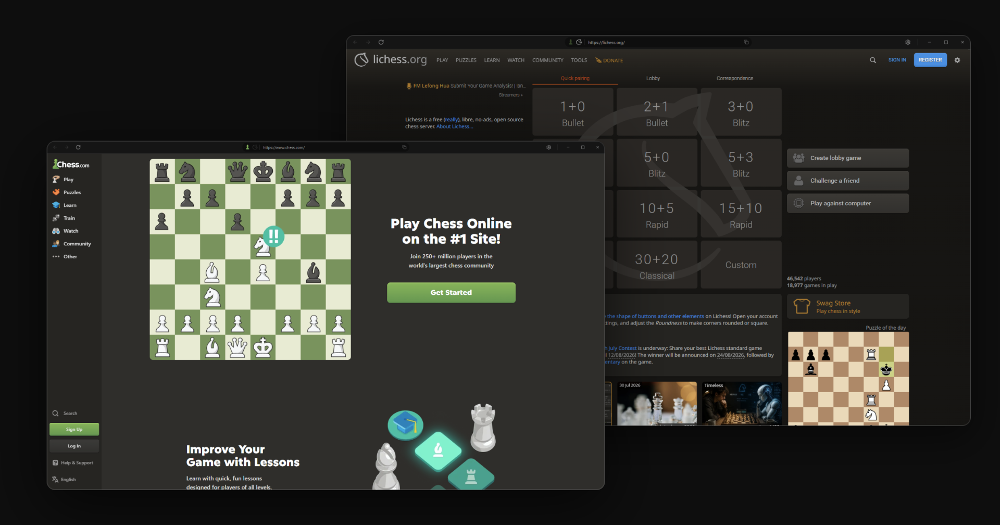

# Chess Desktop

**Play Chess.com and Lichess natively on your desktop.**

Free, open source, for Windows and Linux.

 

[All releases](https://github.com/vocaldll/chess-desktop/releases) · [Website](https://chessdesktop.app)

 

## What it does

- **Chess.com and Lichess in one app**: switch between them instantly, stay signed in to both
- **Picks up where you left off**: remembers the last page on each site, window size, and position
- **Fewer distractions**: hide chat and both players' ratings
- **Hide your opponent**: anonymizes their name, avatar, rating, and chat messages
- **Numbered arrows**: right-click arrows are numbered in the order you drew them
- **Review on Lichess**: one click imports a finished Chess.com game and starts a free computer analysis
- **Desktop controls**: always-on-top mode, keep-awake during games, volume control from the title bar
- **Feels like your browser**: familiar mouse navigation and customizable keyboard shortcuts
- **Discord Rich Presence**: shows your current Chess Desktop activity on your profile
- **No maintenance**: cookie banners rejected automatically, updates install in the background

## Installing

**Windows**: download the installer and run it.

**Linux**: download the AppImage, make it executable (`chmod +x Chess-Desktop.AppImage`, or right click, Properties, allow executing), and start it.

> [!NOTE]
> If Windows SmartScreen warns you, choose "More info", then "Run anyway". The warning appears because the app is unsigned.

## Questions or problems

Found a bug or want something added? [Open an issue](https://github.com/vocaldll/chess-desktop/issues) or write to [contact@chessdesktop.app](mailto:contact@chessdesktop.app).

Anonymous crash reporting can be controlled during setup or in Settings. See the [privacy details](PRIVACY.md) for exactly what is and is not collected.

---

Not affiliated with Chess.com or Lichess. All trademarks belong to their owners. Released under the [MIT License](LICENSE).
